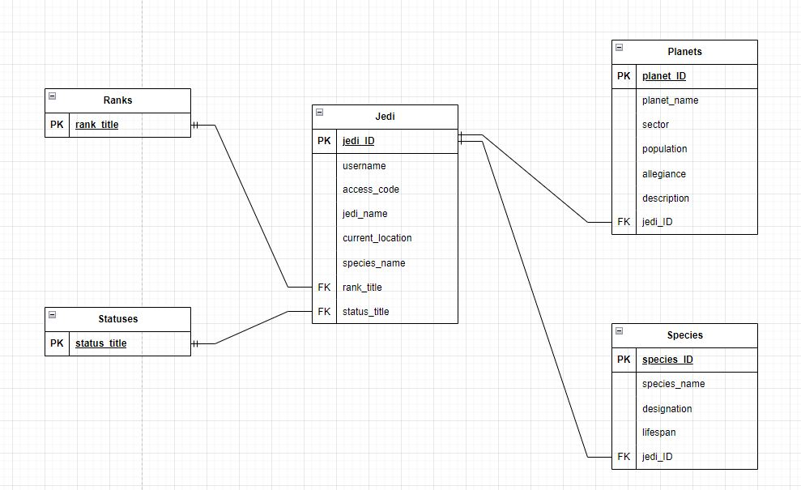

# T2A2 - API Webserver Project
## Jonathan Ow 

[Github Repository](https://github.com/Jow17/API-Webserver-Jedi-Archives)

## Table of Contents:
-  [Installation Instructions](#installation-instructions)
- [R1 - Identifying the problem](#r1---identification-of-the-problem-you-are-trying-to-solve-by-building-this-particular-app)
- [R2 - Justifying the problem](#r2---why-is-it-a-problem-that-needs-solving)
- [R3 - Database System Pros/Cons](#r3---why-have-you-chosen-this-database-system-what-are-the-drawbacks-compared-to-others)
- [R4 - ORM Functionalities and benefits](#r4---identify-and-discuss-the-key-functionalities-and-benefits-of-an-orm)
- [R5 - API Endpoints](#r5---document-all-endpoints-for-your-api)
- [R6 - Entity Relationship Diagram (ERD)](#r6---an-erd-for-your-app)
- [R7 - 3rd party services used](#r7---detail-any-third-party-services-that-your-app-will-use)
- [R8 - Project models and relationships](#r8---describe-your-projects-models-in-terms-of-the-relationships-they-have-with-each-other)
- [R9 - Database relations](#r9---discuss-the-database-relations-to-be-implemented-in-your-application)
- [R10 - Task allocation and tracking](#r10---describe-the-way-tasks-are-allocated-and-tracked-in-your-project)

---
### **Installation Instructions**

#### **Open WSL command line and run the following commands:**

Start PostgreSQL server with:
```sh
sudo service postgresql start
```
Create database:
```sh
create database jedi-archives
```
#### **Open second WSL command line and run the following commands:**

Create virtual environment:
```sh
python3 -m venv .venv
```
If virtual environment is not automatically activated run:
```sh
source .venv/bin/activate
```
Finally, run the following cli commands to set up and run Flask application:
```sh
pip install -r requirements.txt
flask run
flask db create
flask db seed
```
Open postman and use localhost:5555 as port 5555 is set as the default port in .flaskenv

---
### **R1 - Identification of the problem you are trying to solve by building this particular app.**

<p align="center"><em><b>A long time ago, in a galaxy far far away...</b><br></em>


*It is the year 22Bby and the galaxy is on a knife's edge amidst ongoing political turmoil. The prestigious Jedi Order and its 10,000 strong Jedi Knights, the keepers of the peace, are all that stands between the fragile Republic and all out war.*

*Jedi Master Obi-Wan Kenobi, while investigating a plot to assasinate Senator Amidala, has exposed some major flaws in the Jedi Archives as the planet Kamino had been inexplicably removed from the records! It was later discovered that the culprit was non other than former Jedi turned Sith Lord, Count Dooku, using the access codes of the missing Jedi Sifo Dyas.*

*To protect the archives from future breaches, the Jedi council has ordered a full reconstruction of the archives including an overhaul of it's database record systems. The council also requests that that all members of the order are assigned the appropriate level of access and are properly accounted for at all times...*

---

### **R2 - Why is it a problem that needs solving?**


The Jedi archives is the largest repository of records in the known galaxy containing history and information spanning tens of thousands of years. Unfortunately, this also means that its systems are equally as old as the content is stores with numerous flaws that will need to be addressed. Thus the archives are in dire need of an overhaul for a more civilized age.

- **Lack of mobile accessibility:** Whilst the archives are stored in a secure location in the heart of the Jedi temple, this however means that any Jedi needing to access records would have to physically be in the archives. Due to how vast the galaxy has become, this would not only make reading the records difficult and time-consuming as Jedi would have to make long travel times back to Corusant, but updating the current information is also quite inefficient. As the political turmoil throughout the Republic systems has dramatically increased since the invasion of Naboo, Jedi are becoming more and more busy and their effectiveness in the field would be significantly improved if they has ample access to the wealth of knowledge of the archives from anywhere in the galaxy. 

- **Very few authentication/authorisation measures:** Dooku's sudden and unexpected betrayal of the order has raised significant concerns surrounding the archives security systems. As it currently stands, Jedi only need to provide an access code to read and manipulate records. This massive flaw was exploited by Dooku as he used a dead Jedi's codes to delete an entire planet without rousing suspicion. Dooku's actions show that the order has too much blind faith in their members loyalties. Whilst chief librarian Jocusta Nu has done exemplary work in maintaining the archives over her many years of service, security measures will need to be more robust. Proper authorization and authentication should be implemented for all members of the order to ensure that breaches like this do not occur in the future. 

---

### **R3 - Why have you chosen this database system. What are the drawbacks compared to others?**

Using a PostgreSQL database system would successfully address the issues listed in the previous section. It is open source and free ensuring that the Order does not have to expend extra resources or credits to maintain. Data inside a PostgresSQL database is also easily manipulated using the SQL and JSON querying languages. PostgreSQL is suited for large enterprises such as the Jedi Archives as it is highly scalable and provides management for large amounts of data as well as users. Being open source, PostgreSQL has a large community which contribute to its continuous development and improvement. Because of this it has a highly touted reputation which proceeds itself like a certain 4 armed cyborg. Furthermore, PostgreSQL feature rich support for extensions means that additional features functionality and data types can be supported. Thanks to its large community, PostgreSQL has a large library of tools that are supported across different operating systems. 

One of the main reasons for using PostgreSQL specifically is its support for both vertical and horizontal scalling, which means extra data can be added to tables with relative ease. Because the archives contain an almost infinite amount of data, records will take some time to transfer over, however PostgreSQL's scalability will make the process much more efficient.

However, PostgreSQL is not without its flaws when compared to other database types. For starters, Because PostgreSQL is a relational database, it reads records in a table sequentially, meaning that the larger a table becomes, the slower it is to query data. Non relational databases such as MongoDB are more effecient when dealing with high read and write workloads. Data in MongoDB is also de-normalised meaning joins between tables are quicker and less costly. Whilst these are significant advantages over PostgreSQL, PostgreSQL is still the more useful database system as it can deal with large amounts of data far better and can handle complex queries thanks to the SQL language and its sophisticated query optimizations. As the archives grows in scale and complexity, it is important that data can be modified accordingly. 

### **R4 - Identify and discuss the key functionalities and benefits of an ORM**

Whilst querying a database using SQL is an essential part of manipulating data, the process is often complicated and time-consuming. By utilizing a technique called Object Relational Mapping, developers can utlise object oriented programming to connect an oject in an object oriented programming language such as python to an SQL database without needing to query it. ORM's essentially convert the code in the compiled language and translates it and generates SQL code for a relational database such as PostgreSQL to perform the standard CRUD operations such as reading and creating. 

ORM's are extremely useful as they enable developers to use the progamming language of their choice to build implement the necessary parameters for interacting with a database. This essentially removes one of the major drawbacks of a database system like PostgresSQL having a steep learning curve and complex querying methods. Furthermore, developers can easilt switch between different database types without having to modify their current code as ORM's will automatically translate accordingly depending on the database being used. 

Visually, ORMs are easier to read and code as it uses classes that define attributes and business related models. These are called models which are mapped to relational database tables and enables developers to work directly with objects.

---

### **R5 - Document all endpoints for your API**

### **1. /jedi/register**

- **HTTP Request Verb:** POST 

- **Required data:** username, jedi_name, access_code, rank, species, master, apprentice, current_location, status 

- **Expected response data:**  Expected '201 CREATED' response with return of data excluding access code

- **Authentication methods:** A JWT token matching that of a councilmember is needed to authenticate registration

- **Description:** Allows a councilmember to register Jedi to the database 


---

### **2. /jedi/login**

- **HTTP Request Verb:** POST 

- **Required data:** username, password  

- **Expected response data:**  Expected '201 CREATED' response with return of data excluding access code

- **Authentication methods:** username, password 

- **Description:** Allows a Jedi to login provided that username and access code are matching in the database. A JWT token is also generated which required for authorization and use of the archives 


---

### **3. /jedi**

- **HTTP Request Verb:** GET

- **Required data:** None

- **Expected response data:**  Expected '200 OK' response with return of all Jedi in the database excluding access code

- **Authentication methods:** Matching councilmember JWT token

- **Description:** Allows a Jedi councilmember to view all Jedi in the database


---

### **4. /jedi/<jedi_name>**

- **HTTP Request Verb:** GET

- **Required data:** None

- **Expected response data:**  Expected '200 OK' response with return of all data of Jedi exclusing access code

- **Authentication methods:** Matching Jedi councilmember or master JWT token

- **Description:** Allows a Jedi councilmember or master to view a single Jedi in the database


---

### **5. /jedi/<jedi_name>/update/rank**

- **HTTP Request Verb:** PUT, PATCH

- **Required data:** jedi_rank

- **Expected response data:**  Expected '200 OK' response with return of Jedi's name and new rank

- **Authentication methods:** Matching councilmember JWT token

- **Description:** Allows a Jedi councilmember to update the rank of a Jedi


---

### **6. /jedi/<jedi_name>/update**

- **HTTP Request Verb:** PUT, PATCH

- **Required data:** current_location, status

- **Expected response data:**  Expected '200 OK' response with return of Jedi's name, new location and status

- **Authentication methods:** Matching master or councilmember JWT token

- **Description:** Allows a Jedi councilmember to update the location and status of a Jedi


---

### **7. /planets/**

- **HTTP Request Verb:** GET

- **Required data:** None

- **Expected response data:**  Expected '200 OK' response with return of data of all planets in the database

- **Authentication methods:** Matching Jedi JWT token

- **Description:** Allows any Jedi to view all planets in the database


---

### **8. /planets/<planet_name>**

- **HTTP Request Verb:** GET

- **Required data:** None

- **Expected response data:**  Expected '200 OK' response with return of data of a single planet in the database

- **Authentication methods:** Matching Jedi JWT token

- **Description:** Allows any Jedi to view one planet in the database


---

### **9. /planets/**

- **HTTP Request Verb:** POST

- **Required data:** planet_name, sector, population, allegiance, description, jedi_assigned

- **Expected response data:**  Expected '201 OK' response with return of created planet data 

- **Authentication methods:** Matching Jedi master or councilmember JWT token

- **Description:** Allows a Jedi master or councilmember to register a new planet in the database


---

### **10. /planets/<name>**

- **HTTP Request Verb:** PUT, PATCH

- **Required data:** allegiance, jedi_assigned

- **Expected response data:**  Expected '200 OK' response with return of updated planet data 

- **Authentication methods:** Matching Jedi master or councilmember JWT token

- **Description:** Allows a Jedi master or councilmember to update a planet in the database


---

### **11. /planets/<name>**

- **HTTP Request Verb:** DELETE

- **Required data:** None

- **Expected response data:**  Expected '200 OK' response with empty tuple

- **Authentication methods:** Matching Jedi councilmember JWT token

- **Description:** Allows a Jedi councilmember to delete a planet from the database


---

### **12. /species/**

- **HTTP Request Verb:** GET

- **Required data:** None

- **Expected response data:**  Expected '200 OK' response with return of data from all species in the database

- **Authentication methods:** Matching Jedi JWT token

- **Description:** Allows any Jedi to view all species in the database


---

### **13. /species/<species_name>**

- **HTTP Request Verb:** GET

- **Required data:** 

- **Expected response data:**  Expected '200 OK' response with return of data from one species in the database

- **Authentication methods:** Matching Jedi JWT token

- **Description:** Allows any Jedi to view one species in the database


---

### **14. /species/**

- **HTTP Request Verb:** POST

- **Required data:**  species_name, designation, home_planet, lifespan

- **Expected response data:**  Expected '200 OK' response with return of all data from the registered species 

- **Authentication methods:** Matching Jedi master JWT token

- **Description:** Allows a Jedi master to register a new species in the database


---

### **15. /species/<species_name>**

- **HTTP Request Verb:** PUT, PATCH

- **Required data:**  home_planet, designation

- **Expected response data:**  Expected '200 OK' response with return of all data from the updated species

- **Authentication methods:** Matching Jedi master JWT token

- **Description:** Allows a Jedi master to update a species home_planet and designation


---

### **16. /species/<species_name>**

- **HTTP Request Verb:** DELETE

- **Required data:**  None

- **Expected response data:**  Expected '200 OK' response with empty tuple

- **Authentication methods:** Matching Jedi councilmember JWT token

- **Description:** Allows a Jedi councilmember to delete a species from the database


---

### **R6 - An ERD for your app**



---

### **R7 - Detail any third party services that your app will use**

### Flask
Flask is a python framework designed for creating web applications. It provides the ability to create and manage URL routes and handle HTTP requests, among other functionalities.

### SQL Alchemy
SQL Alchemy is a python library that serves as an object relational mapper (ORM). It enables the replacement of raw SQL queries with python code.

### PostgreSQL
PostgreSQL is a robust and freely available database management system with an open-source nature. It is a relational database system that supports querying of data stored via the SQL language

### Marshmallow
Marshmallow is a python library utilised for converting data formats such as JSON into python data types.

### Psycopg2
Psycopg2 is a python adapter that facilitates the connection and manipulation of PostgreSQL databases through python programs.

### Bcrypt
Bcrypt is a password hashing function employed within APIs to securely encrypt and store user passwords.

### JWT Manager
JWT Manager is a python library utilised to manage JSON web tokens, including creation, storage, validation, and overall management.

---

### **R8 - Describe your projects models in terms of the relationships they have with each other**

All models in the application have been stored in a dedicated models folder inside the src directory. SQLalchemy was used to create the class structures 

### Jedi Model: ###

```py
class Jedi(db.Model):
    __tablename__ = 'jedi'

    id = db.Column(db.Integer, primary_key=True)

    username = db.Column(db.String, nullable=False, unique=True)
    access_code = db.Column(db.String, nullable=False)
    jedi_name = db.Column(db.String, nullable=False, unique=True)
    current_location = db.Column(db.Text, nullable=False)
    species_name = db.Column(db.String, nullable=False)
    
    rank_title = db.Column(db.String, db.ForeignKey('ranks.title'), nullable=False)
    rank = db.relationship('Rank', back_populates='jedi')

    status_title = db.Column(db.String, db.ForeignKey('statuses.title'), nullable=False)
    statuses = db.relationship('Status', back_populates='jedi')

    species = db.relationship('Species', back_populates='jedi')

    planets = db.relationship('Planet', back_populates='jedi')

# JSON (de)serialization with Marshmallow
class JediSchema(ma.Schema):
    rank = fields.Nested('RankSchema')
    statuses = fields.Nested('StatusSchema')
    username = fields.String(validate=Length(min=6, error = 'Username must be at least 6 characters'))
    access_code = fields.String(validate=Length(min=8, error = 'Access code must be as least 8 characers long'))
    
    class Meta:
        fields = ("id", "username","access_code", "jedi_name", "current_location", "species_name", "rank_title", "status_title",)
```

The Jedi model relates to the Status and Rank models in a one to one relationship. The unique titles of the Rank and Status models is used as a foreign keys. ```db.relationship ``` is set up on both ends of the models which ensures they are both mapped together, the ```back_populates``` argument specifies which column will be linked in the table. The rank and statuses tables schemas are nested inside the Jedi Schema. The model also relates to the Species and Planets models and is also mapped by a the ```back_populates```  argument.

### Planets Model: ###

```py
# Creates table structure with column names and data types 
class Planet(db.Model):
    __tablename__ = 'planets'

    id = db.Column(db.Integer, primary_key=True)

    planet_name = db.Column(db.String, nullable=False, unique=True)
    sector = db.Column(db.String, nullable=False)
    population = db.Column(db.String)
    allegiance = db.Column(db.String, nullable=False)
    description = db.Column(db.Text)

    jedi_id = db.Column(db.Integer, db.ForeignKey('jedi.id'), nullable=False)
    jedi = db.relationship('Jedi', back_populates='planets') 

# JSON (de)serialization with Marshmallow
class PlanetSchema(ma.Schema):
    jedi = fields.Nested('JediSchema', only=['jedi_name'])
    allegiance= fields.String(required=True, validate=OneOf(VALID_ALLEGIANCES))

    class Meta:
        fields = ('id','planet_name', 'sector', 'population', 'allegiance', 'description','jedi',) 
```
The Planets model contains the jedi_id foreign key which is the primary key in the Jedi model. It has a one to one relationship with the Jedi model via ```db.relationship``` and is linked using the ```back_populates``` argument. The Jedi schema is also nested in the model's Schema and will be returned as a JSON object when called. 

### Rank Model: ###

```py
# Creates table structure with column names and data types 
class Rank(db.Model):
    __tablename__ = 'ranks'

    title = db.Column(db.String, primary_key=True, unique=True)

    jedi = db.relationship('Jedi', back_populates= 'rank')


# JSON (de)serialization with Marshmallow
class RankSchema(ma.Schema):

    class Meta:
        fields = ('title',)
```

The Rank model has a onne to one relationship with the Jedi model as one Jedi can only have one rank. The relationship is established using  `db.relationship` and the `backpopulates` argument ensures that the model's primary key is linked to the Jedi model. RankSchema is used to serialize the model as JSON and will only return the rank title.

### Status Model: ###

```py
# Creates table structure with column names and data types 
class Status(db.Model):
    __tablename__ = 'statuses'

    title = db.Column(db.String, primary_key=True,)


    jedi = db.relationship('Jedi', back_populates= 'statuses')

    
# JSON (de)serialization with Marshmallow
class StatusSchema(ma.Schema):

    class Meta:
        fields = ('title',)
```
The Status model contains the jedi_id foreign key which is the primary key in the Jedi model. It has a one to one relationship with the Jedi model as Jedi can only have one status and this is done via ```db.relationship``` and is linked using the ```back_populates``` argument. The JediSchema is also nested in the model's Schema and will be returned as a JSON object when called. 

### Species Model: ###
```py
VALID_DESIGNATIONS = ('Sentient' , 'Non-sentient', 'Semi-sentient')

# Creates table structure with column names and data types 
class Species(db.Model):
    __tablename__ = 'species'

    id = db.Column(db.Integer, primary_key=True)

    species_name = db.Column(db.String, nullable=False)
    designation = db.Column(db.String, nullable=False)
    lifespan = db.Column(db.String)

    jedi_id = db.Column(db.Integer, db.ForeignKey('jedi.id'), nullable=False)
    jedi = db.relationship('Jedi', back_populates='species')

# JSON (de)serialization with Marshmallow 
class SpeciesSchema(ma.Schema):
    jedi = fields.Nested('JediSchema', only=['jedi_name'])
    designation = fields.String(validate=OneOf(VALID_DESIGNATIONS))

    class Meta:
        fields = ('id', 'species_name', 'designation', 'lifespan', 'jedi_id',)
```
The Species model has a one to many relationship with the Jedi model as one Jedi can register many species. The foreign key jedi_id is used and the relationship between the 2 models is established via `db.relationship` and `back_populaes` which ensures the 2 models are linked together. The JediSchema has been nested inside model's Schema to show which Jedi was the one what registed the model.

---

### **R9 - Discuss the database relations to be implemented in your application**


- Jedi to Ranks, One to One

A Jedi can only have one of three ranks Councilmember, Master and Knight, which all unique and grant certain priveleges of accessing. This is displayed via the foreign key which links to the rank_title primary key in Ranks. By putting them in a separate tables, this ensures that they remain unique and cannot be reassigned or changed unless the correct route is called by a Jedi with the councilmember rank. Ranks also determine which routes can be used and this is done so in a seperate file called auth.py which has two functions that check whether a Jedi has a certain rank. This ensures that some such as registering new Jedi can only be done by councilmembers whilst others such as registering species and planets can be done by both masters and councilmembers. 

- Jedi to Statuses , One to One 

Likewise a Jedi can only have one of three statuses, Alive, Unknown and Deaceased, which are all unique primary keys from the Status table. This is done to address the original security issue of being able to use access codes and details of deceased or missing Jedi to use the archives. In addition to checking the rank of Jedi, the functions in auth.py will also check the status of the Jedi by comparing it to the JWT token. Whilst a deceased Jedi's access codes can be used to login, they will only able to read, be unable to register or update any records. 

- Jedi to Planets, One to Many 

Planets contain the foreign key jedi_id to ensure that jedi who register new planets can be tracked. Jedi can register as many new planets as they want however each planet will only have the name of the Jedi who registered and this is returned as a JSON list. Only a Jedi with the master rank can create and update a planet but only a councilmember can delete a planet. 

- Jedi to Species, Many to Many 

Species contain the foreign key jedi_id to ensure that jedi who register new species can be tracked. Jedi masters can register as many new species as they want however each species will only have the name of the Jedi who registered and this is returned as a JSON list. Only a Jedi with the master rank can create and update a species but only a councilmember can delete a species. 

---

### **R10 - Describe the way tasks are allocated and tracked in your project**

Trello was the main application for tracking my progress. Each model and blueprint has its own card and individual checklist which contains a list of all the functions in each files. For purposes of organisation and seperation of concerns, I have categorised them into 4 groups.

- To do: Files or tasks that have yet to be created 
- Doing: Tasks and files that are in the development phase
- Testing: files that have been completed but need testing, in this case routes that need to be tested will then be placed here
- Complete: Files that have been successfully tested and completed are finally moved to this category

Using the #standups channel in the Coderacademy discord was also helpful as it ensures accountability and enables other students to see the progress that each other makes and be encouraged, especially when they encounter similar issues with their code. 

### Screenshots ###


